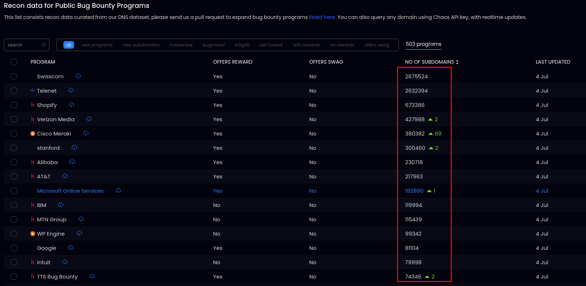
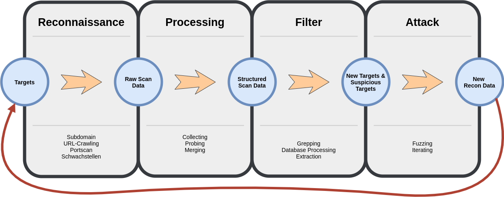
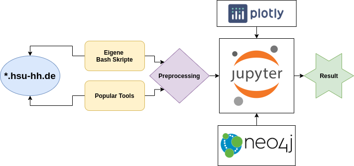
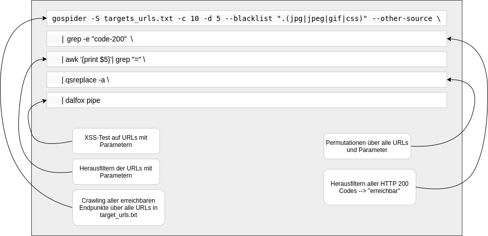
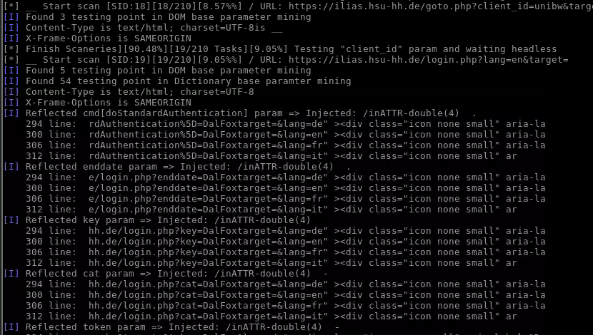
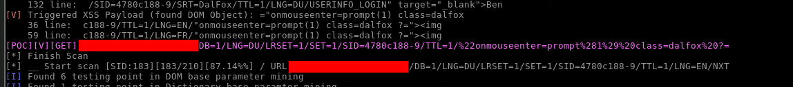

# Wer bin ich?

##
\begin{center}
    \includegraphics[width=0.2\columnwidth]{images/me.png}
\end{center}

  * David Lassig (Hauptmann), Zeitsoldat bis 2022
  * Großteil der Dienstzeit im Zentrum Cyber-Operationen (Ethical Hacking und Data Engineering), seit 2019 im CIHBw (ZSwKBw)
  * "dienstlich" u.a. derzeit mit Orchestrierung und DevSecOps beschäftigt
  * privat Beteiligung an BugBounty-Programmen/Plattformen und Maker-Basteleien (IoT, 3D-Druck)

# Impuls

## BugBounty und VDP

  * großes Wachstum an BugBounty und VDP-Programmen
  * "Crowd-Sourced" Security Scanning kann durch kein Tool ersetzt werden
  * charakteristisch sind große Scopes mit vielen Zielen

{#id .class width=57% height=50%}

## Große Scopes und viele Daten

## Automatisierung und Datenpipelines

# Ablauf

## Betrachtete Probleme

  * Wie erzeuge ich effizient und skaliert Recon-Daten als Grundlage für weitere Schwachstellen-Untersuchung?
  * Wie filtere ich diese Daten nach interessanten Informationen?
  * Wie visualiere ich diese Daten für zusätzliche/grundlegende Erkenntnisse?

## Ablauf

{#id .class height=70%}

# Subdomains

## Subdomain Methodologie - Passiv
  
  * Quellen für passives Subdomain-Crawling:
    * SSL-Zertifikate (Censys, GoogleCT, FacebookCT)
    * Öffentliche Database APIs (BinaryEdge, SecurityTrails, Chaos, C99)
    * Web Archive (Wayback, ArchiveIt)
    * Scraping (Baido, Bing, Yahoo)

  * --> [https://github.com/OWASP/Amass](https://github.com/OWASP/Amass)

~~~{.bash}
amass enum -passive -d example.com -config path/amass_config.ini
~~~

## Subdomain Methodologie - Aktiv

  * aktive Methode für Subdomain-Crawling
    * ReverseLookup
    * Zonen-Transfer
    * Bruteforce mit kontextbezogenen Permutationen
    * CIDR und ASN Sweeping ([ASN?](https://bgpview.io/prefix/139.11.0.0/16)) 
    * --> [https://github.com/OWASP/Amass](https://github.com/OWASP/Amass)

~~~{.bash}
amass enum -active -d example.com -asn 1234 -cidr 10.0.0.0/20 -config path/amass_config.ini
~~~

## Subdomain Processing und Visualisierung

~~~{.bash}
for domain in $sd_source; do

	# passive amass with additional scripts
	amass enum -scripts $DIR/amass_exts/ -passive -d $domain -o $sd/passive_subs_amass_$domain -include assetfinder,subfinder,github-subdomains -config /home/user/tools/configs/amass_config.ini
	
	# active amass
	amass enum -active -d $domain $ama_asn $ama_cidr -o $sd/active_subs_amass_$domain -ip -config /home/user/tools/configs/amass_config.ini

	# brute-forcing
	subbrute.py ~/tools/wordlists/subdomains.txt $domain | filter-resolved > $sd/brute_subs_subbrute_$domain
~~~

\vspace{1cm}
\begin{block}{DEMO}
  Jupyter: Vearbeiten und Darstellen von amass/subbrute Daten als Graph
\end{block}

# Portscans

## Alte und neue Wege

  * [+] **nmap** ist besonders genau
  * [+] **nmap** hat viele Plugins für Fingerprinting
  * [--] **nmap** ist sehr langsam und Default-Scans landen in Firewall

  * [+] **masscan** ist besonders schnell (gesamtes Internet in 3min)
  * [+] **masscan** nutzt eigenen TCP/UDP-Stack
  * [--] **masscan** keine Plugins oder sonstiger Komfort

  * --> Kombination aus Beidem
    * [https://github.com/capt-meelo/MassMap](https://github.com/capt-meelo/MassMap)

## Portscan Processing und Visualisierung

~~~{.bash}
./massmap.sh scope_ips
~~~

\vspace{1cm}
\begin{block}{DEMO}
  Jupyter: Vearbeiten und Darstellen von massmap/nmap Daten als Graph
\end{block}

# Schwachstellenscans

## Einfache Kollaboration und Skalierbarkeit gewinnt

  * nikto und nmap-Plugins haben weiterhin Daseinsberechtigung
  * jedoch zunehmend CI/CD, Skalierbarkeit und Erweiterbarkeit wichtig
  
  * --> [https://github.com/projectdiscovery/nuclei](https://github.com/projectdiscovery/nuclei) 

\begin{center}
    \includegraphics[width=0.6\columnwidth]{images/nucleitemplate.png}
\end{center}
	

## Schwachstellenscans Processing und Visualisierung

~~~{.bash}
echo "$domain" | nuclei -rl 20 -c 3 -silent \
		-t ~/tools/signatures/nuclei-templates/ \
	       	-o "$sd"/nuclei_"$domain_fn"
~~~

\vspace{1cm}
\begin{block}{DEMO}
  Jupyter: Vearbeiten und Filtern von nuclei Scandaten
\end{block}

# URLs

## Quellen und Tools

  * Alte Versionen von Webseiten
    * WaybackMachine, Archive.org
    * --> [https://github.com/tomnomnom/waybackurls](https://github.com/tomnomnom/waybackurls), [https://github.com/lc/gau](https://github.com/lc/gau)
  * Spidering über zugängliche Seiten
    * --> gospider, Burp Spider, scrapy
  * Threat Exchanges und URL Crawl Datenbanken
    * Alien Labs Open Threat Exchange
    * Common Crawl
    * --> [https://github.com/lc/gau](https://github.com/lc/gau)

\vspace{1cm}
\begin{block}{DEMO}
  Shell: Einfachheit URL Farming mit gau
\end{block}

## One-Liner KungFu

  * [https://github.com/dwisiswant0/awesome-oneliner-bugbounty](https://github.com/dwisiswant0/awesome-oneliner-bugbounty)

## One-Liner KungFu

## One-Liner KungFu

  * obfuscate the URL

## Spider Processing

~~~{.bash}
function_curl_and_save() {
	origin_url=$1
	filename=$(cat /dev/urandom | tr -dc 'a-zA-Z0-9' | fold -w 16 | head -n 1)
	
	origin=$(echo "$origin_url" | cut -d"|" -f1)
	url=$(echo "$origin_url" | cut -d"|" -f2-)
	
	if [ ! -z $url ]; then
		curl_resp=$(curl -Ls -m 3 -w "%{http_code}|$origin|$url|%{url_effective}|%{time_redirect}|%{num_redirects}|%{size_download}|%{content_type}|$filename" $url -o "$html_output_dir"/"$filename" )

		echo $curl_resp | tee -a curl_html_resp
		if [[ $curl_resp = 404* ]]; then
			rm "$html_output_dir"/"$filename"
		fi
	fi
}
~~~

  * Tool zur Filterung sensibler Informationen [https://github.com/tomnomnom/gf](https://github.com/tomnomnom/gf)

\vspace{1cm}
\begin{block}{DEMO}
  Shell: Filterung HTML und JS Quellen mit gf
\end{block}

## Spider Processing und Visualisierung

\vspace{1cm}
\begin{block}{DEMO}
  Jupyter: Verarbeitung und Visualisierung von URL-Daten
\end{block}

# Wie WAFs vermeiden?

## Parallelisierung von Zielen

  * viele Ziele gleichzeitig und iterativ betrachten
  * [https://github.com/tomnomnom/meg](meg) scannt viele URL-Pfade und viele Hosts iterativ

\vspace{1cm}
\begin{block}{DEMO}
  Shell: Scan mit meg
\end{block}

## Parallelisierung der Angriffsmaschinen

  * mit Axiom können schnell und elegent Cloud-Instanzen zu Hacking-Cluster orchestriert werden
    * -> hohe Parallelität mit sehr vielen IP-Adressen
  * [https://github.com/pry0cc/axiom](Axiom)
  
\vspace{1cm}
\begin{block}{DEMO}
  Shell: Orchestration einer Axiom Fleet und Distributed Scanning <3 <3 <3
\end{block}

# Kern und Ausblick

## Kernbotschaft

  * BugBounty/VDP kann schnell zu BigData-Problem werden
    * Datenverarbeitung
    * schnellstmögliche Datenfilterung und -visualisierung
  * Automatisiere so viel wie möglich
  * Skillset + OpenSource > Propriätere Scan-Tools

## Ausblick

  * Integration und Automatisierung in einheitliche Tool-Pipeline
  * Einsatz von GNNs (Graph Neural Networks)
